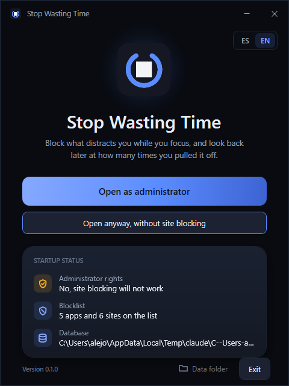
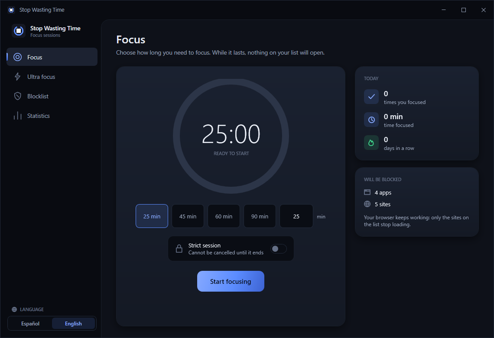
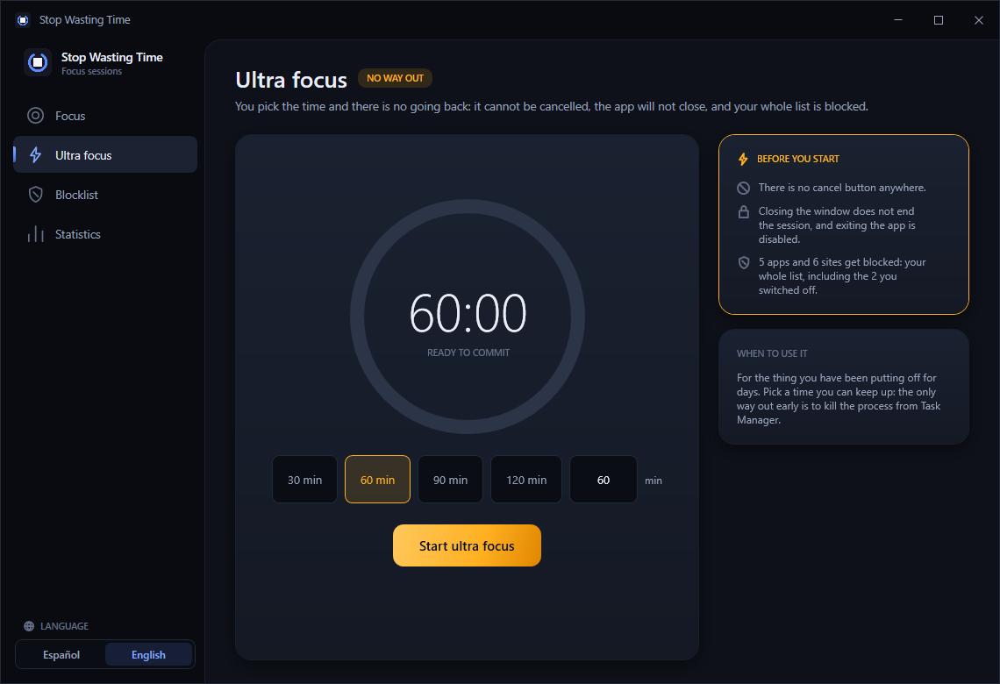
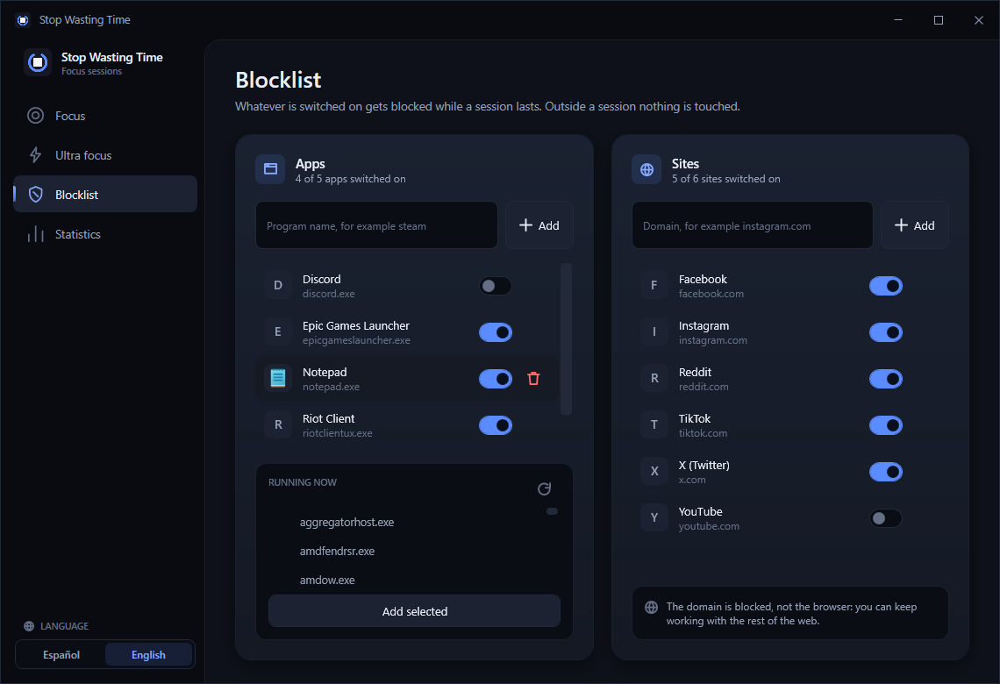
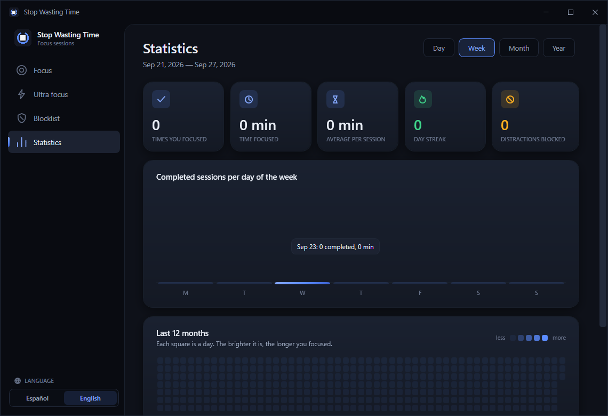

# Stop Wasting Time

A Windows desktop app that closes the apps and blocks the sites that distract you for as long as you
decide to concentrate, and then shows you how often you actually did it.

You pick a duration, press start, and for that stretch Steam, Instagram, TikTok and whatever else is on
your list simply will not open. Your browser keeps working: only the listed sites stop resolving, so you
can still look things up while you work. When the time is up everything comes back on its own, and the
session is recorded — per day, per week, per month and per year.



## Features

- **Timed focus sessions.** 25, 45, 60 or 90 minutes, or any number you type in.
- **Strict sessions.** An optional switch per session: while it runs the session cannot be cancelled and
  the app cannot be closed.
- **Ultra focus.** A screen of its own for when the switch is not enough: you set the time, confirm once,
  and there is no cancel button at all. It enforces the whole blocklist, including the entries you had
  switched off, and the app refuses to quit until the clock runs out.
- **App blocking.** Programs on your list are closed a second after they open, for as long as the session
  lasts. System processes are never touched, no matter what you put on the list.
- **Site blocking.** Listed domains are pointed at `0.0.0.0` in the Windows hosts file while the session
  runs, and the file is restored afterwards. The browser itself is left alone.
- **A distraction counter.** Every blocked attempt is recorded, so you can see what tempts you and how
  often.
- **The blocklist looks like your programs.** Each app shows its real Windows icon, remembered from the
  last time it was seen running, so the list is scannable instead of being a column of file names.
- **Statistics.** Sessions completed, time focused, average session, current streak and blocked
  distractions, with a bar chart per period and a year heatmap.
- **Tray icon.** Closing the window never closes the app: it goes to the tray and keeps working, because
  a blocker that stops blocking the moment the window is in the way is not a blocker. Leaving for real is
  the Exit entry in the tray menu, and that is refused while an ultra or strict session runs.
- **Spanish and English.** The interface starts in the language Windows is displayed in and can be
  switched at any moment, from the launcher or from the bottom of the navigation rail. Everything changes
  on the spot, dates and numbers included, and the choice is remembered.
- **Crash recovery.** If the app is killed mid session, the next launch closes that session as abandoned
  and removes the hosts block, so a crash can never leave sites blocked forever.

| Focus | Ultra focus |
|---|---|
|  |  |

| Blocklist | Statistics |
|---|---|
|  |  |

## Requirements

- Windows 10 or 11 (x64).
- [.NET 10 SDK](https://dotnet.microsoft.com/download) to build it, or just the .NET 10 Desktop Runtime to
  run a framework dependent build. A self contained build needs neither.
- **Administrator rights.** The app manifest asks Windows for them at launch. They are needed to edit the
  hosts file and to close programs the app did not start. Without them the app still runs and still
  blocks apps, but it says plainly that site blocking will not work.

## Getting started

Clone the repository and start it:

```
run.cmd
```

That builds the app and launches it. Windows will ask for administrator rights.

To get an executable you can keep:

```
powershell -ExecutionPolicy Bypass -File scripts/publish.ps1
```

This writes `publish\StopWastingTime.exe`, self contained (~130 MB, runs on any Windows x64 machine
without installing .NET). Add `-FrameworkDependent` for a ~4 MB executable that needs the .NET 10 Desktop
Runtime installed.

Then, if you want it on the desktop:

```
powershell -ExecutionPolicy Bypass -File scripts/create-shortcut.ps1
```

### Using it

1. The launcher shows what it managed to set up and one button to open the app. When you are not running
   as administrator, that button restarts the app elevated instead. The `ES | EN` switch in its corner
   picks the language.
2. On **Blocklist** (*Bloqueos*), pick the apps and sites to block. The app list offers the programs
   running right now, so you do not have to know executable names, and you can also type one. Sites take
   anything you paste: `https://www.instagram.com/explore` becomes `instagram.com`.
3. On **Focus** (*Enfoque*), choose a duration, optionally turn on *strict session*, and start.
4. **Ultra focus** (*Enfoque ultra*) is the same thing without an exit: it asks once, then blocks
   everything on the list until the time is up. There is no cancel button, and the app will not quit.
5. **Statistics** (*Estadísticas*) shows how it went, by day, week, month or year.

## How it works

```
FocusSessionService  ── starts/stops ──►  BlockingCoordinator
        │                                      │
        │ stores the session                   ├─► ProcessBlocker    sweeps the process list once a
        ▼                                      │                     second and closes what matches
   SQLite database                             │
   (sessions, rules, hits)                     └─► HostsFileBlocker  writes a marked block into the
                                                                     Windows hosts file
```

- **A session is stored as `Running` before anything else happens.** If the machine dies mid session the
  attempt is not lost, and the next launch knows it has cleaning up to do.
- **Elapsed time comes from the clock, not from counting ticks.** A missed timer tick or a sleeping
  laptop cannot buy extra minutes or lose them.
- **Apps are blocked by polling.** A one second sweep of the process list is cheap, needs no driver, and
  catches a program a moment after it opens. `ProcessNames.Protected` lists the processes that are never
  closed — `explorer`, `csrss`, `lsass`, the app itself and the rest — so a blocklist entry can never
  leave Windows unusable.
- **Sites are blocked through the hosts file**, between `# >>> Stop Wasting Time >>>` and
  `# <<< Stop Wasting Time <<<` markers. Anything else in that file is left exactly as it was, the
  original is backed up to `hosts.backup` before the first change, and the block is removed when the
  session ends. Building that text is a pure function, `HostsFileEditor`, covered by its own tests,
  because it is the one piece that could damage a system file.
- **Sessions store the local calendar date next to the UTC instant.** Grouping by day, week or month is
  then a plain `GROUP BY` instead of time zone arithmetic in SQL, and the numbers match the calendar you
  actually live in.
- **Focused time counts abandoned sessions too** — an abandoned 20 minute session was still 20 minutes of
  focus. Completed and abandoned are counted separately.
- **A streak survives today.** Not having focused yet today does not break it; the count ends yesterday,
  so a streak only dies after a full day without focus.
- **An ultra session ignores the switches on the blocklist.** Every rule is applied, so nothing on the
  list is left as an escape hatch. It is the one thing that separates it from an ordinary strict session.
- **One timer drives whichever session is running.** It lives outside the screens, so a session started
  on one of them keeps counting while you are looking at another.

## Project structure

```
StopWastingTime.slnx
├─ src/StopWastingTime.Core/          net10.0          Domain, storage, blocking, statistics
│  ├─ Models/                                          Sessions, rules, blocked attempts
│  ├─ Data/                                            SQLite schema and repositories
│  ├─ Blocking/                                        Process watcher, hosts file editor, coordinator
│  ├─ Sessions/                                        The session state machine
│  ├─ Settings/                                        Saved preferences, which language to show
│  └─ Stats/                                           Day/week/month/year aggregation
├─ src/StopWastingTime.App/           net10.0-windows  WPF user interface
│  ├─ Views/                                           Launcher, shell, the four screens, toast
│  ├─ ViewModels/                                      One per screen, MVVM
│  ├─ Controls/                                        Countdown ring, caption, language picker
│  ├─ Infrastructure/                                  Elevation, logging, single instance
│  ├─ Localization/                                    The Localizer and the {loc:Tr} markup extension
│  ├─ Resources/                                       Strings.resx (English), Strings.es.resx (Spanish)
│  └─ Themes/                                          Palette and control styles
├─ tests/StopWastingTime.Core.Tests/  net10.0          xUnit
└─ scripts/                                            Run, publish, shortcut, icon generation
```

Everything that could go wrong quietly — editing the hosts file, matching process names, aggregating
statistics, the session state machine, the schema migrations — lives in `Core` behind interfaces, so it
is tested without opening a window or touching the system.

The interface draws its own window caption rather than using the system one, which is light and would
sit on a dark app like a sticker. Colours, spacing, typography and control styles all come from
`Themes/Palette.xaml`, and the icons are geometry in `Themes/Icons.xaml`: no icon font to go missing, and
one weight across the app.

## Configuration and data

Everything the app stores lives in `%LOCALAPPDATA%\StopWastingTime`:

| File | What it is |
|---|---|
| `stopwastingtime.db` | SQLite database: sessions, blocklist, blocked attempts. Upgraded in place when the schema changes, so history is never lost |
| `hosts.backup` | The hosts file as it was before the app ever changed it |
| `app.log` | Startup and session log. A windowed app has no console, so this is where a failed launch explains itself |
| `settings.json` | Preferences: for now, the interface language. Delete it to go back to following Windows |

Set `SWT_DATA_DIR` to put that folder somewhere else — useful for trying the app against a throwaway
profile, or for keeping it on a portable drive:

```
set SWT_DATA_DIR=D:\swt-profile
```

To start over, close the app and delete the database. The blocklist is seeded again on the next launch.

## Development

```
dotnet build StopWastingTime.slnx -c Release
```

```
dotnet test StopWastingTime.slnx
```

The icon is generated rather than committed as an opaque binary, so its shape and palette stay editable:

```
powershell -ExecutionPolicy Bypass -File scripts/generate-icon.ps1
```

### Translations

Every word the interface shows lives in `src/StopWastingTime.App/Resources`: `Strings.resx` is English,
and also what any missing translation falls back to; `Strings.es.resx` is Spanish. Views ask for text
with `{loc:Tr Key}`, which follows the language picker without rebuilding the view, and view models go
through the `Localizer` for sentences with numbers in them. Sentences that change with a count come in
pairs, `Key_One` and `Key_Other`.

To add a language:

1. Copy `Strings.resx` to `Strings.xx.resx` and translate the values. The comments in the English file
   say what each `{0}` stands for.
2. Add the code to `AppLanguages.Supported` in `src/StopWastingTime.Core/Settings/AppLanguages.cs`, and
   an entry named in its own language to `Localizer.Languages`.
3. Run the tests. They check that every language has every key, that no translation drops or invents a
   placeholder, and that every key the app asks for exists.

## Known limitations

- **DNS over HTTPS bypasses the hosts file.** Chrome's *Secure DNS* and Firefox's DoH resolve names
  themselves, which the hosts file cannot intercept. Turn it off (Chrome: *Settings → Privacy and
  security → Security → Use secure DNS*) for site blocking to work.
- **A blocked app is closed, not paused.** Anything unsaved in it is lost. That is why blocking only
  happens during a session, and why system processes are protected.
- **Blocking only applies while a session runs.** Outside a session nothing is touched: this is a focus
  tool, not a permanent filter.
- **Administrator rights are all or nothing.** Without them the app blocks programs it has permission to
  close and tells you site blocking is off.
- **An ultra session really cannot be stopped from inside the app.** Ending one early means killing the
  process from Task Manager, and the next launch will unblock everything and record the session as
  abandoned. Pick a duration you can live with.
- **Dialog buttons follow Windows.** The confirmation before an ultra session is a standard Windows
  message box, so its OK and Cancel buttons come in the language Windows is displayed in, whatever the
  app is set to.
- **Windows only.** The blocking is built on the Windows process list and the Windows hosts file.

## Roadmap

- Blocklist profiles (study, work, evening) instead of one list.
- Scheduled sessions at fixed times of day.
- Exporting the statistics.
- An installer, so it does not have to be published by hand.

## License

MIT. See [LICENSE](LICENSE).
